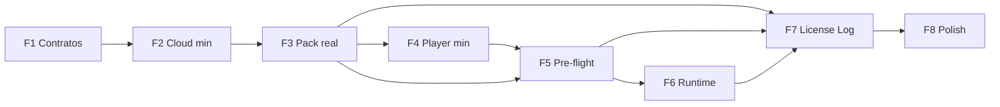

# TelaFlow — Plano de Implementação do MVP (MVP_IMPLEMENTATION_PLAN)

**Versão:** 1.0.4  
**Status:** Documento normativo — referência para ordem de trabalho, dependências entre módulos, entregáveis, critérios de pronto, limites do MVP e disciplina de execução  
**Última revisão:** 2026-04-10  

**Hierarquia normativa:** Este plano é **derivado e subordinado** a, **nesta ordem**: [PRODUCT_SPEC.md](./PRODUCT_SPEC.md), [ARCHITECTURE_SPEC.md](./ARCHITECTURE_SPEC.md), [UI_SPEC.md](./UI_SPEC.md), [EVENT_EDITOR_FEATURE_SPEC.md](./EVENT_EDITOR_FEATURE_SPEC.md), [PRE_FLIGHT_FEATURE_SPEC.md](./PRE_FLIGHT_FEATURE_SPEC.md), [PACK_EXPORT_FEATURE_SPEC.md](./PACK_EXPORT_FEATURE_SPEC.md), [PLAYER_RUNTIME_FEATURE_SPEC.md](./PLAYER_RUNTIME_FEATURE_SPEC.md), [LICENSING_FEATURE_SPEC.md](./LICENSING_FEATURE_SPEC.md), [AUDIT_LOGGING_SPEC.md](./AUDIT_LOGGING_SPEC.md). Em caso de ambiguidade ou conflito aparente, **prevalece** o documento mais acima na lista; desvios de implementação exigem **revisão explícita** das specs envolvidas e **ADR** quando a decisão for estrutural.

**Escopo:** planejamento de implementação do **MVP** — **sem código**, **sem estimativas de calendário obrigatórias** neste documento (podem existir em ferramentas de projeto à parte). O plano **não redefine** produto: **materializa** o que as specs já decidiram numa **sequência executável**.

**Stack oficial (MVP):** conforme [ARCHITECTURE_SPEC.md](./ARCHITECTURE_SPEC.md) e [MASTER_CONTEXT.md](../context/MASTER_CONTEXT.md): **Cloud** — Next.js (App Router), FastAPI, PostgreSQL; **Player** — Tauri 2, React + Vite; **persistência local inicial** — JSON, manifestos, logs (SQLite local apenas se necessidade comprovada, por ADR).

**Princípio de fluxo:** [PRODUCT_SPEC.md](./PRODUCT_SPEC.md) §5 — **Cloud → Pack → Player**. Nenhuma fase deste plano deve consolidar atalhos permanentes que quebrem essa cadeia.

---

## Prefácio

As especificações normativas descrevem **o sistema correto**; não descrevem, por si só, **a ordem em que o erro custa menos**. Implementar “um pouco de tudo” em paralelo — Cloud rica, Player experimental, Pack ainda indefinido — produz integração falsa: parece avanço, mas o **contrato** entre equipas oscila e o retrabalho concentra-se no Pack, que é precisamente o elo que **congela** a verdade operacional ([ARCHITECTURE_SPEC.md](./ARCHITECTURE_SPEC.md) §2.3).

Este documento fixa uma **macro-ordem** em oito fases, com **dependências explícitas**, **critérios de pronto** e **limites do que não deve ser puxado para a frente**. A intenção é **execução disciplinada**: o MVP não é “menos features”, é **primeiro o que estabiliza o contrato**, depois o que o consome.

Visão consolidada de identidade, stack e governança (incluindo índice de documentos): [MASTER_CONTEXT.md](../context/MASTER_CONTEXT.md) §13–§16. Em caso de divergência com as especificações normativas, prevalecem as specs e **este** plano conforme a hierarquia no cabeçalho.

---

# 1. Papel do plano de implementação

## 1.1 Por que as specs não bastam sem ordem

Uma spec excelente **reduz** ambiguidade de requisito; **não elimina** ambiguidade de **sequência**. Duas equipas podem estar ambas fiéis ao texto e mesmo assim **incompatíveis no terreno** — por exemplo, o Player a implementar uma FSM completa enquanto o formato do Pack e os identificadores estáveis ainda não estão fechados ([PACK_EXPORT_FEATURE_SPEC.md](./PACK_EXPORT_FEATURE_SPEC.md), [EVENT_EDITOR_FEATURE_SPEC.md](./EVENT_EDITOR_FEATURE_SPEC.md)). O plano traduz o grafo de dependências implícito das specs num **caminho** que minimiza dependências circulares e **integrações provisórias** que viram dívida permanente.

## 1.2 Por que a ordem protege qualidade

Qualidade no TelaFlow não é só estética ou cobertura de testes: é **aderência ao fluxo Cloud → Pack → Player**, **pre-flight como controlo** ([ARCHITECTURE_SPEC.md](./ARCHITECTURE_SPEC.md) §2.7), **licença e integridade como barreiras** ([LICENSING_FEATURE_SPEC.md](./LICENSING_FEATURE_SPEC.md)), e **observabilidade como superfície de confiabilidade** ([AUDIT_LOGGING_SPEC.md](./AUDIT_LOGGING_SPEC.md), [PRODUCT_SPEC.md](./PRODUCT_SPEC.md) §7). Uma ordem errada **antecipa** UI ou integrações **antes** de existir o artefato que a UI deve honestamente representar no palco — o Pack — e **subverte** a arquitetura híbrida que o produto promete.

---

# 2. Princípio geral do MVP

O MVP do TelaFlow **não** é “construir todos os módulos em paralelo para demo”. É **construir primeiro o que estabiliza o contrato** entre Cloud, Pack e Player — isto é: **identificadores e modelos compartilhados**, **formato de exportação auditável**, **manifesto de mídia**, **estados nomeados** do runtime e da validação, **só depois** refinamento de experiência e camadas opcionais.

Concretamente: **sem contrato de Pack credível**, o Player vira protótipo acoplado ao que a Cloud “parece” mandar; **sem Cloud mínima que persista evento/cena com disciplina**, o export não tem o que serializar com sentido de negócio ([EVENT_EDITOR_FEATURE_SPEC.md](./EVENT_EDITOR_FEATURE_SPEC.md)); **sem pre-flight real**, o produto viola a promessa de checklist operacional ([PRE_FLIGHT_FEATURE_SPEC.md](./PRE_FLIGHT_FEATURE_SPEC.md), [PRODUCT_SPEC.md](./PRODUCT_SPEC.md) §4).

---

# 3. Ordem oficial de implementação

A ordem **normativa** do MVP é a seguinte. Fases posteriores **assumem** conclusão dos critérios de pronto das anteriores (detalhe em §14).

| Fase | Nome | Âncora de valor |
|------|------|-----------------|
| **1** | Contratos centrais | Schemas, ids, modelo de evento/cena no papel do sistema, contrato Pack **como verdade**. |
| **2** | Cloud funcional mínima | Auth, persistência, CRUD de evento e cena **disciplinado**, branding mínimo. |
| **3** | Pack real | Export, serialização, assinatura mínima, snapshot consistente e auditável. |
| **4** | Player mínimo | Abrir Pack, ler manifesto, binding simples — **sem** runtime completo. |
| **5** | Pre-flight real | Checks principais, severidades, resultado que alimenta FSM (`ready` / falha). |
| **6** | Runtime executável | Cenas, transições, controles do operador conforme FSM. |
| **7** | Licensing + Logging integrados | Licença operacional, logs úteis, auditoria mínima Cloud e local. |
| **8** | Acabamento premium | UI_SPEC, microcopy, polish — **depois** do núcleo honesto. |

Esta ordem **não** é sugestão de sprint zero: é **sequência de dependência** alinhada ao [ARCHITECTURE_SPEC.md](./ARCHITECTURE_SPEC.md) §1 e ao [PRODUCT_SPEC.md](./PRODUCT_SPEC.md) §5.

## 3.1 Primeira vertical obrigatória do MVP

Após esta ordem macro, a equipa precisa de **um** fluxo real **ponta a ponta** que prove o produto — não uma coleção de telas isolados. A **primeira vertical obrigatória** do MVP é, em sequência:

1. **Criar evento** na Cloud (persistido, com identidade/organização conforme fases cumpridas).  
2. **Criar duas Scenes** mínimas (tipos e conteúdo conforme [EVENT_EDITOR_FEATURE_SPEC.md](./EVENT_EDITOR_FEATURE_SPEC.md) — o número **dois** força roteiro mínimo não trivial).  
3. **Exportar Pack** pelo pipeline real (não artefato manual): `export_id`, integridade e snapshot alinhados a [PACK_EXPORT_FEATURE_SPEC.md](./PACK_EXPORT_FEATURE_SPEC.md).  
4. **Abrir o Pack no Player** (offline para este núcleo).  
5. **Binding** da mídia exigida pelo manifesto (workspace local, paths relativos conforme [ARCHITECTURE_SPEC.md](./ARCHITECTURE_SPEC.md)).  
6. **Pre-flight** até resultado que permita **`ready`** (ou falha explícita e corrigível — [PRE_FLIGHT_FEATURE_SPEC.md](./PRE_FLIGHT_FEATURE_SPEC.md)).  
7. **Executar duas Scenes** no runtime (transições e controles conforme [PLAYER_RUNTIME_FEATURE_SPEC.md](./PLAYER_RUNTIME_FEATURE_SPEC.md)).

Esta vertical é o **primeiro produto vivo real**: demo interna, critério de integração e referência para testes (§16). **Licenciamento e logging** completos (§10) elevam o MVP a **auditável** e **suportável**; não substituem a obrigação de fechar a vertical de palco até ao passo 7 — o Pack exportado deve já cumprir o mínimo de licença/claims exigido pelas specs à data da fase, para o fluxo não ser teatro.

## 3.2 Propriedade conceitual por fase (owner mental)

**Owner** aqui é **foco de energia e competência dominante**, não necessariamente uma pessoa única nem silo organizacional. Serve para alinhar revisões de código e prioridade de PRs.

| Fase | Propriedade conceitual dominante |
|------|----------------------------------|
| **1** | Contratos compartilhados, ids, modelo de domínio — **backend / schema** em conjunto com quem define o Pack legível. |
| **2** | **Cloud** end-to-end mínima: FastAPI + PostgreSQL + auth; Next.js funcional sem polish. |
| **3** | **Export** server-side, serialização, assinatura, auditoria de export — backend + contrato com front de disparo. |
| **4** | **Player**: Tauri, leitura de Pack, manifesto, binding persistido — domínio local. |
| **5** | **Player**: motor de pre-flight, FSM até `ready` / falhas — validação e narrativa operacional. |
| **6** | **Player**: runtime, FSM de execução, controles do operador. |
| **7** | **Transversal**: licença (Cloud emissão + Player validação), logs e correlação ([AUDIT_LOGGING_SPEC.md](./AUDIT_LOGGING_SPEC.md)) — backend Cloud + Player. |
| **8** | **UI/UX** e microcopy em Cloud e Player — sem alterar contratos congelados (§14.1). |

## 3.3 Vertical crítica antes de refino estrutural

**Não** se abre **refatoração estrutural de grande alcance** (rewrite amplo de UI da Cloud, reorganização que atravessa limites de módulo já consumidos pelo Player, redesenho da FSM “por estética”, mudança de stack) **enquanto a primeira vertical obrigatória (§3.1) não estiver fechada** com critérios verificáveis.

**Regra:** a **vertical crítica fecha** antes de **refino estrutural** opcional. Polish premium e ajustes visuais **normativos** concentram-se na **Fase 8**; refinos que **tocam contrato** exigem **ADR** e atualização de specs, independentemente da fase.

---

# 4. FASE 1 — Contratos centrais

## 4.1 Objetivo

Estabelecer **linguagem comum imutável** entre Cloud e Player: o que é um `event_id`, como se versiona o conteúdo exportável, como o manifesto referencia mídia, quais **domínios de identificadores** são estáveis ([EVENT_EDITOR_FEATURE_SPEC.md](./EVENT_EDITOR_FEATURE_SPEC.md)), e como o **Pack** declara integridade e metadados ([PACK_EXPORT_FEATURE_SPEC.md](./PACK_EXPORT_FEATURE_SPEC.md)).

## 4.2 Entregáveis conceituais

- **Schemas ou contratos compartilhados** (conceituais, documentados; implementação pode ser pacote comum, OpenAPI, JSON Schema — decisão técnica fora deste plano) alinhados ao export e ao runtime.  
- **Política de ids**: o que é gerado na Cloud, o que é preservado no Pack, o que o Player deve tratar como opaco.  
- **Modelo central de Evento / Cena / requisitos de mídia** coerente com o editor e com o manifesto — **sem** ainda exigir UI polida.  
- **Leitura normativa** do **contrato Pack**: o que entra no snapshot, o que é assinável, o que é auditável ([PACK_EXPORT_FEATURE_SPEC.md](./PACK_EXPORT_FEATURE_SPEC.md) §20, [AUDIT_LOGGING_SPEC.md](./AUDIT_LOGGING_SPEC.md)).

## 4.3 Deliberadamente fora desta fase

Interfaces de usuário elaboradas, fluxo completo de autoria, Player além de stubs de leitura. O foco é **reduzir retrabalho** nas fases 2–4.

**Execução detalhada:** [PHASE_1_EXECUTION_SPEC.md](./PHASE_1_EXECUTION_SPEC.md) — referência normativa para repositório, contratos, persistência, endpoints e vertical mínima desta fase.

---

# 5. FASE 2 — Cloud funcional mínima

## 5.1 Objetivo

Ter uma Cloud **utilizável** que **persista** o estado editável antes do export, com **multi-tenant** e **autorização por organização** ([ARCHITECTURE_SPEC.md](./ARCHITECTURE_SPEC.md) §3.1), alinhada ao princípio “**evento como unidade central**” ([ARCHITECTURE_SPEC.md](./ARCHITECTURE_SPEC.md) §1.2, [EVENT_EDITOR_FEATURE_SPEC.md](./EVENT_EDITOR_FEATURE_SPEC.md)).

## 5.2 Entregáveis

- **Autenticação mínima** fiável (sessão/conta/organização — detalhe em spec de segurança ou ADR; o MVP exige **identidade**, não “login fake”).  
- **CRUD de evento** disciplinado: criar, editar estrutura, associar à organização; sem genericidade que anule o domínio.  
- **CRUD de cena** (e estruturas dependentes conforme [EVENT_EDITOR_FEATURE_SPEC.md](./EVENT_EDITOR_FEATURE_SPEC.md)) com validações **server-side** ([ARCHITECTURE_SPEC.md](./ARCHITECTURE_SPEC.md) §2.2 — regras de negócio no backend).  
- **Branding mínimo** aplicável ao que virá no Pack (identidade visual suficiente para não ser placeholder vazio — alinhado a [UI_SPEC.md](./UI_SPEC.md) princípios de marca e consistência, sem exigir pixel-perfection).  
- **Frontend** Next.js App Router e **API** FastAPI + PostgreSQL conforme stack oficial.

## 5.3 Deliberadamente contido

“Overdesign” de permissões granulares, marketplaces, integrações terceiros, armazenamento de mídia na Cloud ([PRODUCT_SPEC.md](./PRODUCT_SPEC.md) §2.2, [ARCHITECTURE_SPEC.md](./ARCHITECTURE_SPEC.md) §3.1 **Limites**).

---

# 6. FASE 3 — Pack real

## 6.1 Objetivo

Produzir **exportação real** que materialize o snapshot acordado nas specs: **serialização**, **assinatura mínima**, **consistência** e **trilha auditável** ([PACK_EXPORT_FEATURE_SPEC.md](./PACK_EXPORT_FEATURE_SPEC.md); [AUDIT_LOGGING_SPEC.md](./AUDIT_LOGGING_SPEC.md) §5, §15).

## 6.2 Entregáveis

- **Pipeline de export** desde o estado persistido até artefato empacotado (formato conforme spec de export — zip ou equivalente normativo).  
- **Manifesto de mídia** coerente com o declarado no editor; **sem** armazenar blobs na Cloud — o manifesto descreve o que o Player deve **encontrar** localmente ([ARCHITECTURE_SPEC.md](./ARCHITECTURE_SPEC.md) §2.6).  
- **Assinatura mínima** e verificação de integridade alinhadas à spec de Pack (o MVP **não** dispensa integridade em nome de velocidade).  
- **Registro de exportação** na Cloud: `export_id`, atores, ligação a evento/organização — base da auditoria comercial ([AUDIT_LOGGING_SPEC.md](./AUDIT_LOGGING_SPEC.md)).

## 6.3 Risco a evitar

Export “que funciona na demo” mas **não** é determinístico ou **não** documenta ordem canônica de arquivos para assinatura — [PACK_EXPORT_FEATURE_SPEC.md](./PACK_EXPORT_FEATURE_SPEC.md) deve ser respeitada, não reinterpretada em cada sprint.

---

# 7. FASE 4 — Player mínimo

## 7.1 Objetivo

Aplicação **Tauri 2 + React + Vite** que **abra** o Pack, **leia** manifestos e estado serializado, e permita **binding** simples (`media_id` → path local) — [ARCHITECTURE_SPEC.md](./ARCHITECTURE_SPEC.md) §3.3, persistência JSON/manifestos/logs.

## 7.2 Entregáveis

- Fluxo **abrir Pack** (arquivo/workspace) e **validação superficial** de estrutura legível.  
- **Leitura de manifesto** e apresentação de lista de requisitos de mídia (o operador precisa **ver** o que falta antes do runtime).  
- **Binding** persistente local — sem executar ainda o **roteiro completo** nem todas as transições da FSM.  
- **Offline** no núcleo desta fase: sem dependência de Cloud para **ler** o Pack ([ARCHITECTURE_SPEC.md](./ARCHITECTURE_SPEC.md) §2.5).

## 7.3 Deliberadamente fora

Runtime completo, sorteios em palco, animações finas — evita que o Player seja construído em cima de comportamento ainda não validado pelo pre-flight.

---

# 8. FASE 5 — Pre-flight real

## 8.1 Objetivo

Implementar o **Pre-flight** como **componente arquitetural** ([ARCHITECTURE_SPEC.md](./ARCHITECTURE_SPEC.md) §2.7): agregar checagens de integridade, licença (na medida já exigida pela spec), mídia e consistência mínima do roteiro ([PRE_FLIGHT_FEATURE_SPEC.md](./PRE_FLIGHT_FEATURE_SPEC.md)).

## 8.2 Entregáveis

- **Checks principais** por grupos normativos (G1…G5 na spec de pre-flight), com **severidades** bloqueante vs. aviso e **códigos estáveis** onde a spec exige.  
- **`run_id`** e **resultado sintético** por run, alinhados a [AUDIT_LOGGING_SPEC.md](./AUDIT_LOGGING_SPEC.md) §7.  
- **Saída real para FSM**: transição para estado **`ready`** apenas quando critérios mínimos forem atendidos; caso contrário **`preflight_failed`** ou **`blocked`** conforme [PLAYER_RUNTIME_FEATURE_SPEC.md](./PLAYER_RUNTIME_FEATURE_SPEC.md) e [PRE_FLIGHT_FEATURE_SPEC.md](./PRE_FLIGHT_FEATURE_SPEC.md).

## 8.3 Critério de honestidade

Pre-flight **não** é lista cosmética: se um check está na spec como bloqueante, o Player **não** deve poder contornar silenciosamente.

---

# 9. FASE 6 — Runtime executável

## 9.1 Objetivo

Executar o roteiro **no telão** conforme **FSM** e regras de cena ([PLAYER_RUNTIME_FEATURE_SPEC.md](./PLAYER_RUNTIME_FEATURE_SPEC.md)): ativação e conclusão de cenas, transições atómicas, controles do operador com debounce onde aplicável.

## 9.2 Entregáveis

- **Scene execution** e **scene transitions** alinhados à spec de runtime (incl. ordem causal `completed` antes de avançar quando normativo).  
- **Operator controls** (avançar, pausar, encerrar, sorteio — conforme escopo MVP nas specs, não “todos os gestos futuros”).  
- Comportamento de **falha** e estados terminais (`blocked`, `finished`) **visíveis** e **registáveis** (preparação para §10).

## 9.3 Relação com UI

A execução obedece a [UI_SPEC.md](./UI_SPEC.md) para estados de palco, leitura à distância e calma operacional — **implementação** desta camada visual pode ser iterativa, mas **não** antecipa §8 de forma a contradizer estados da FSM.

---

# 10. FASE 7 — Licensing + Logging integrados

## 10.1 Objetivo

Fechar o **ciclo de confiança**: licença **validável** no Player, falhas **auditáveis**, logs **úteis** e **correlacionáveis** com `export_id`, `run_id`, `license_id` onde aplicável ([LICENSING_FEATURE_SPEC.md](./LICENSING_FEATURE_SPEC.md); [AUDIT_LOGGING_SPEC.md](./AUDIT_LOGGING_SPEC.md)).

## 10.2 Entregáveis

- **Licença real** no fluxo MVP: emissão ou ancoragem na Cloud, consumo no Player, validação e mensagens de falha com códigos canônicos; **grace** e **UTC** conforme spec de licenciamento.  
- **Logging Cloud**: export, licença, ações administrativas mínimas ([AUDIT_LOGGING_SPEC.md](./AUDIT_LOGGING_SPEC.md) §5, §15).  
- **Logging Player**: eventos mínimos pack_load, preflight_run, fsm, execução, bloqueios — com **estrutura conceitual** e **opcional** `caused_by_event_code` onde fizer sentido ([AUDIT_LOGGING_SPEC.md](./AUDIT_LOGGING_SPEC.md) §6–§10).  
- **Extrato exportável para suporte** (últimos N eventos sob demanda — política de N fora deste plano, requisito funcional presente).

## 10.3 O que esta fase não é

Não é substituir **product analytics** nem **SIEM** enterprise; é **cumprimento** das superfícies de auditoria e diagnóstico já definidas como parte do produto.

---

# 11. FASE 8 — Acabamento premium

## 11.1 Objetivo

Elevar a experiência à **postura premium** do TelaFlow ([PRODUCT_SPEC.md](./PRODUCT_SPEC.md) §1, [UI_SPEC.md](./UI_SPEC.md)): refinamento visual, microcopy, consistência de estados vazios e de erro, **sem** alterar o contrato fundamental decidido nas fases 1–7.

## 11.2 Entregáveis

- Ajustes de **UI_SPEC**: hierarquia, espaçamento, estados de loading/erro, modos de apresentação.  
- **Microcopy** alinhado às specs de feature (pre-flight, licenciamento, runtime) — mensagens derivadas, não logs brutos no tela de execução ([AUDIT_LOGGING_SPEC.md](./AUDIT_LOGGING_SPEC.md) §17).  
- **Polish** de fluxos críticos: primeiro abertura de Pack → pre-flight → ready → execução.

## 11.3 Guarda

Acabamento **não** autoriza mudanças silenciosas em **event_code**, formato Pack ou semântica de licença — [AUDIT_LOGGING_SPEC.md](./AUDIT_LOGGING_SPEC.md) §13.3, [PACK_EXPORT_FEATURE_SPEC.md](./PACK_EXPORT_FEATURE_SPEC.md).

---

# 12. Dependências obrigatórias entre fases

Relação **normativa** (simplificada):

- **F2 depende de F1:** sem contratos, a Cloud persiste dados que não serializam de forma previsível.  
- **F3 depende de F2:** export exige estado de evento/cena **real** na base.  
- **F4 depende de F3:** o Player mínimo valida **contra** um Pack gerado pelo pipeline real, não contra mocks eternos.  
- **F5 depende de F4 e fortemente de F3:** pre-flight valida **conteúdo** do Pack e **presença** local; binding é pré-requisito.  
- **F6 depende de F5:** não há execução “oficial” sem passagem honesta pelo pre-flight (salvo fluxos de excepção explicitamente normativos — se existirem, documentados).  
- **F7 depende de F3, F5, F6:** licença e logs ganham sentido **no** fluxo completo; logging de export (Cloud) já nasce em F3 mas **integração** normativa com Player e correlação ficam maduras em F7.  
- **F8 depende de F1–F7:** polish sobre fundações estáveis.

---

# 13. O que NÃO fazer cedo demais

Lista **explícita** (reforça [PRODUCT_SPEC.md](./PRODUCT_SPEC.md) §2.2 e [ARCHITECTURE_SPEC.md](./ARCHITECTURE_SPEC.md) §1.3):

1. **Billing / monetização complexa** — não ancora o contrato Pack; atrai modelo de dados errado antes do valor operacional.  
2. **Multi-template / marketplace de terceiros** — fora do MVP de produto; aumenta superfície sem fechar o núcleo.  
3. **Telemetria de produto agressiva ou pipelines SIEM** — [AUDIT_LOGGING_SPEC.md](./AUDIT_LOGGING_SPEC.md) §20; telemetria **opt-in** é evolução, não substituto do núcleo.  
4. **Editor “livre” sem estrutura** — contradiz evento/cena disciplinados ([EVENT_EDITOR_FEATURE_SPEC.md](./EVENT_EDITOR_FEATURE_SPEC.md)).  
5. **Armazenamento de mídia na Cloud** — explicitamente fora do MVP arquitetural salvo revisão normativa.  
6. **SQLite local “porque sim”** — só com ADR e necessidade comprovada ([ARCHITECTURE_SPEC.md](./ARCHITECTURE_SPEC.md) §15).  
7. **Acoplamento Player ↔ Cloud** para o **show** — o núcleo offline não pode ser comprometido por conveniência de desenvolvimento ([ARCHITECTURE_SPEC.md](./ARCHITECTURE_SPEC.md) §2.5).  
8. **Automatismos que escondem falhas de pre-flight** — viola explicitude ([ARCHITECTURE_SPEC.md](./ARCHITECTURE_SPEC.md) §2.8).

---

# 14. Critério de pronto por fase

Cada fase considera-se **fechada** apenas se:

| Fase | Critérios de pronto (mínimos) |
|------|-------------------------------|
| **1** | Contratos documentados e **aceites** como base para desenvolvimento Cloud e Player; ids e versionamento **sem** ambiguidade conhecida bloqueante. |
| **2** | Usuário autenticado pode **criar/editar** evento e cenas **persistidos**; API **server-side** valida regras centrais; branding mínimo **persistente**. |
| **3** | Export **reproduzível** gera Pack **aberto** pelo pipeline de validação interna; `export_id` e auditoria mínima **registados**; assinatura/integridade **verificáveis** conforme spec. |
| **4** | Player **abre** Pack real, **lê** manifesto, **persiste** binding; **offline** para este núcleo. |
| **5** | Pre-flight produz **`PreflightResult`** / narrativa operacional alinhada à spec; **`run_id`**; FSM **não** entra em `ready` com bloqueantes não resolvidos. |
| **6** | Runtime percorre roteiro **conforme** FSM da spec; transições e controles **testáveis** manualmente em cenário controlado. |
| **7** | Licença **exercida** no fluxo feliz e em falhas representativas; logs Cloud e Player **correlacionáveis**; extrato para suporte **viável**. |
| **8** | **UI_SPEC** e microcopy **revisados** nos fluxos críticos; sem regressão conhecida de contrato (Pack, licença, FSM). |

## 14.1 Política de congelamento por fase

**Uma fase não permanece “aberta” indefinidamente.** Quando os **critérios de pronto** da tabela acima forem **atingidos e declarados** (aceite explícito da equipa ou papel definido em governança), essa fase entra em **estado fechado** para efeitos de **contrato**.

**Congelamento (o quê):** a partir do fecho, **mudanças estruturais** aos artefactos normativos daquela baseline — formato ou campos do Pack consumidos pelo Player, contratos de API já em uso, modelos de id estáveis, semântica da FSM **já exercida** na vertical — **não** entram por refatoração casual: exigem **ADR** e **atualização das specs** afetadas.

**O que não é congelamento:** correção de bugs **compatíveis** (sem alterar contrato observável), melhorias de performance que preservam comportamento, microcopy e UI **dentro** da Fase 8 sem redefinir estados normativos.

**Objetivo:** impedir que “só mais um ajuste” na Fase 2 desfaça o Pack da Fase 3 sem rastreio — o [ARCHITECTURE_SPEC.md](./ARCHITECTURE_SPEC.md) §22 e a disciplina de ADR aplicam-se aqui de forma **operacional**.

## 14.2 Dívida técnica permitida no MVP

Política mínima para **execução real** (incl. assistência por IA) sem confundir **rápido** com **provisório eterno**.

**Permitido:**

- **TODOs locais pequenos** desde que **delimitados** (arquivo/módulo), com **referência** a tarefa ou issue, e **sem** alterar o contrato público do módulo.  
- Ajustes internos de implementação que **não** exportam tipos ou formatos “temporários” ao outro runtime.

**Proibido:**

- **Contratos provisórios**: formatos Pack “temporários”, endpoints placeholder de que o Player passa a depender, tipagem ou serialização ad hoc que **definem** integração sem spec, bypass de validação normativa atrás de flag.  
- Qualquer “vamos corrigir antes do release” que **já** é usado pela vertical (§3.1) — isso **é** o contrato até ADR dizer o contrário.

---

# 15. Estratégia de branches

- **Trunk-based** com **branches curtas** por fase ou por fatia vertical **dentro** da fase — integração à linha principal **frequente**, não maratonas de semanas.  
- **Evitar** branches long-lived com “MVP inteiro” acumulado: reproduz o risco que este plano tenta eliminar — **drift** de contrato.  
- **ADR** para mudanças que atravessem fases (ex.: alteração de campo no Pack).  
- **Feature flags** apenas se **não** mascararem estados proibidos (ex.: saltar pre-flight em produção).

---

# 16. Estratégia de testes do MVP

Sem **paralisia** por cobertura nem **falta** de disciplina:

- **Contratos primeiro:** validação de serialização Pack, hashes/assinatura, **round-trip** conceitual Cloud → export → Player leitura.  
- **Fluxos críticos primeiro:** a **primeira vertical obrigatória** (§3.1) é o **núcleo** da suíte de smoke; estender para login → encerrar, falhas de licença e de integridade como **caminhos obrigatórios** de teste manual ou automatizado conforme capacidade da equipa.  
- **Regressão** em alterações de `event_code` ou formato Pack — [AUDIT_LOGGING_SPEC.md](./AUDIT_LOGGING_SPEC.md) §13.3.

Testes **não** substituem as specs; **confirmam** que a implementação **é** a spec na prática.

---

# 17. Relação com Cursor / IA

Ferramentas de IA aceleram **texto e código**, mas **não** substituem **ordem normativa** nem **leitura das specs da fase em curso**.

- **Nenhuma** implementação assistida por IA deve **ignorar** a spec da fase ativa — se a spec for insuficiente, **atualizar a spec** (e ADR se necessário) **antes** de codificar à frente.  
- **Proibido** “saltar” fases para gerar demo impressionante — o [ARCHITECTURE_SPEC.md](./ARCHITECTURE_SPEC.md) §1.4 já nomeia o risco de improviso; a IA amplifica-o se não houver **checkpoint** explícito por fase (§14).  
- **Prompts** devem referenciar **arquivo e seção** das specs (ex.: PRE_FLIGHT §6, PACK_EXPORT §20) para reduzir alucinação de requisito.  
- Respeitar **§3.1** (vertical), **§14.1** (congelamento) e **§14.2** (nada de contrato provisório “só desta vez”).  
- Propostas de **nova** funcionalidade: passar primeiro pelo [FEATURE_EVALUATION_FRAMEWORK.md](./FEATURE_EVALUATION_FRAMEWORK.md); **spec só depois** da avaliação.  
- **Infraestrutura, distribuição do Player e ambientes:** obedecer ao [DEPLOYMENT_MODEL_SPEC.md](./DEPLOYMENT_MODEL_SPEC.md).

---

# 18. Anti-padrões de implementação

1. **Player que chama Cloud** para decisão de palco em tempo real.  
2. **Pack gerado à mão** em produção contornando a Cloud.  
3. **Pre-flight** que só regista avisos mas **não** impede `ready` quando bloqueante.  
4. **Logs** com PII ou segredos ([AUDIT_LOGGING_SPEC.md](./AUDIT_LOGGING_SPEC.md) §12).  
5. **Renomear** `event_code` ou campos Pack **sem** processo de compatibilidade.  
6. **UI** que mostra log bruto ao operador em execução ([UI_SPEC.md](./UI_SPEC.md), [AUDIT_LOGGING_SPEC.md](./AUDIT_LOGGING_SPEC.md) §17).  
7. **Prometer** offline e depender de rede para **carregar** o show.  
8. **Crítico repetido em avalanche** sem agregação ([AUDIT_LOGGING_SPEC.md](./AUDIT_LOGGING_SPEC.md) §11.1).  
9. **Refatorar** UI Cloud ou arquitetura do Player “para ficar bonito” **antes** de fechar a **primeira vertical** (§3.1) — viola §3.3.  
10. **Reabrir fase fechada** sem ADR quando a alteração é **estrutural** (§14.1).

---

# 19. Evolução após MVP

Naturalmente **depois** do critério da fase 8 e dos objetivos de produto de [PRODUCT_SPEC.md](./PRODUCT_SPEC.md):

- Integrações com ecossistemas terceiros **além** do mínimo de export e identidade ([PRODUCT_SPEC.md](./PRODUCT_SPEC.md) §2.2).  
- Persistência local mais rica (ex.: SQLite) **se** justificado.  
- Telemetria opt-in e **sync** opcional Player–Cloud ([AUDIT_LOGGING_SPEC.md](./AUDIT_LOGGING_SPEC.md) §20).  
- Funcionalidades de **streaming** ou **engajamento social** — apenas se alinhadas à categoria de produto (§1.4 PRODUCT).  
- **Marketplace** e templates de terceiros — roadmap de produto, não MVP.

Cada item **exige** revisão de specs e ADR quando tocar contratos.

---

# 20. Critério normativo final

O **MVP** do TelaFlow é **execução disciplinada** do que [PRODUCT_SPEC.md](./PRODUCT_SPEC.md), [ARCHITECTURE_SPEC.md](./ARCHITECTURE_SPEC.md), [UI_SPEC.md](./UI_SPEC.md) e as specs de feature já **decidiram**: **Cloud → Pack → Player**, com **pre-flight**, **licença**, **integridade** e **observabilidade** como partes do comportamento esperado — não como backlog infinito. Desviar da ordem deste plano **sem** atualizar as fontes normativas é **desvio de produto**, não “agilidade”.

Toda implementação do MVP deve **obedecer** a este documento e à hierarquia de specs no cabeçalho.

---

*Documento interno de planejamento — TelaFlow. MVP_IMPLEMENTATION_PLAN v1.0.4. Derivado de [PRODUCT_SPEC.md](./PRODUCT_SPEC.md) v1.1, [ARCHITECTURE_SPEC.md](./ARCHITECTURE_SPEC.md) v1.1, [UI_SPEC.md](./UI_SPEC.md) v1.0, [EVENT_EDITOR_FEATURE_SPEC.md](./EVENT_EDITOR_FEATURE_SPEC.md) v1.1, [PRE_FLIGHT_FEATURE_SPEC.md](./PRE_FLIGHT_FEATURE_SPEC.md) v1.1, [PACK_EXPORT_FEATURE_SPEC.md](./PACK_EXPORT_FEATURE_SPEC.md) v1.0.2, [PLAYER_RUNTIME_FEATURE_SPEC.md](./PLAYER_RUNTIME_FEATURE_SPEC.md) v1.0.1, [LICENSING_FEATURE_SPEC.md](./LICENSING_FEATURE_SPEC.md) v1.0.1 e [AUDIT_LOGGING_SPEC.md](./AUDIT_LOGGING_SPEC.md) v1.0.1.*
